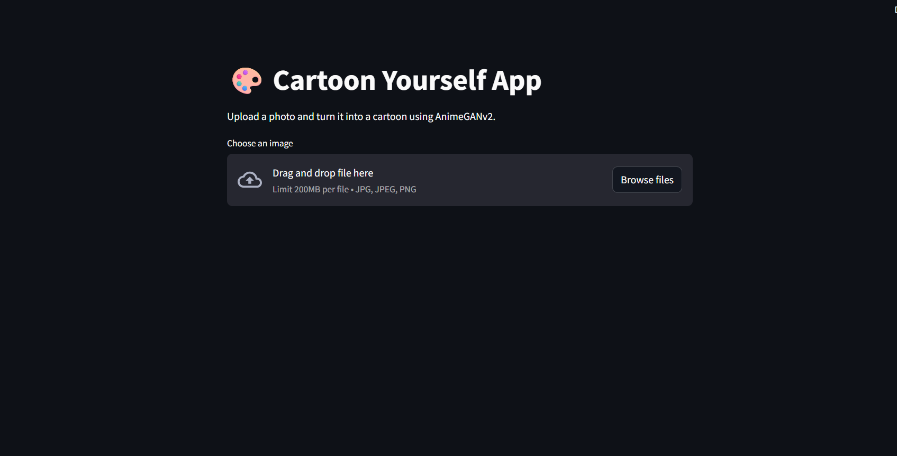
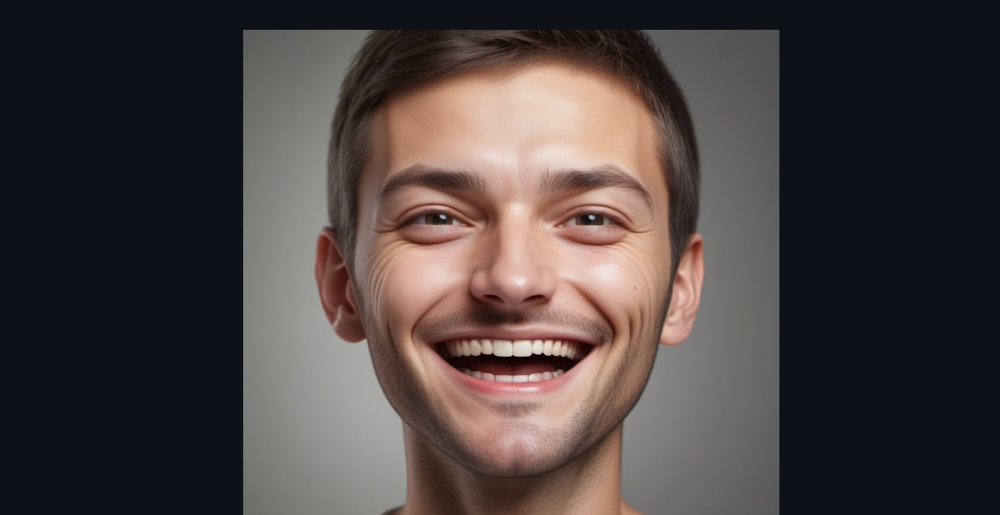
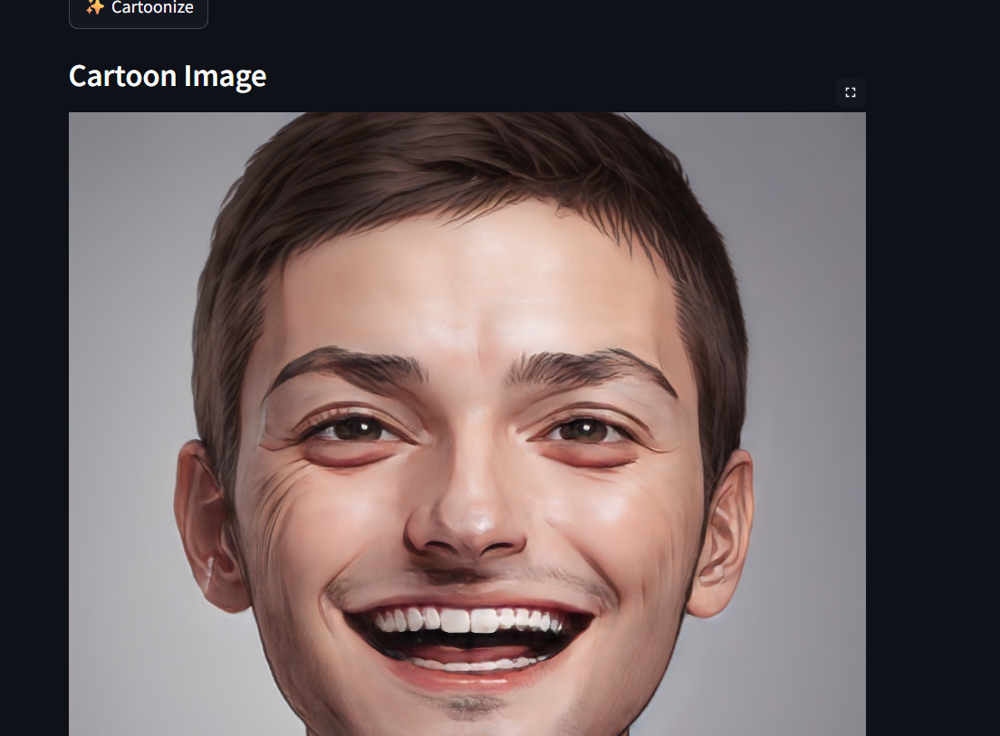

# Cartoon-image-generation

Transform your photos into anime-style cartoons using AnimeGANv2, PyTorch, and Streamlit.

This project allows users to upload an image and instantly convert it into a cartoon-style portrait using deep learning.

🚀 Live Features

✨ Upload your photo
🎭 Convert real images into anime/cartoon style
⚡ Fast image processing using PyTorch
⬇️ Download the generated cartoon image
🖥 Easy-to-use Streamlit web interface

🖼 Application Preview

Cartoon Image
### Web Application

### Original Image

### Cartoon Output

🧠 Model Used

This project uses AnimeGANv2, a deep learning model designed for fast anime-style image transformation.

Advantages:

High quality cartoon output

Fast inference

Works well on human faces

🛠 Tech Stack

Python

Streamlit

PyTorch

Torchvision

AnimeGANv2

⚙️Installation

 1.Clone Repository- https://github.com/kiruthika-024/Cartoon-image-generation-
 
 2.Move to Project Folder - cd cartoon-yourself-app
 
 3.Install Dependencies - pip install -r requirements.txt
 
 4. Run the App - streamlit run app.py
 
📸 How the App Works

    User uploads an image
 
    Image is resized and normalized
 
    AnimeGANv2 processes the image
 
    Cartoon-style output is generated
 
    User downloads the cartoon image

🔮 Future Improvements

   Multiple cartoon styles

   Cartoon video generation
